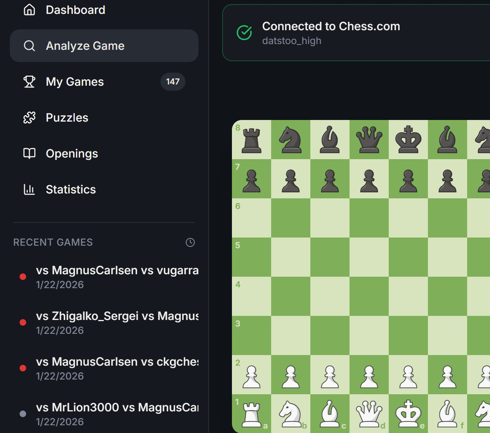
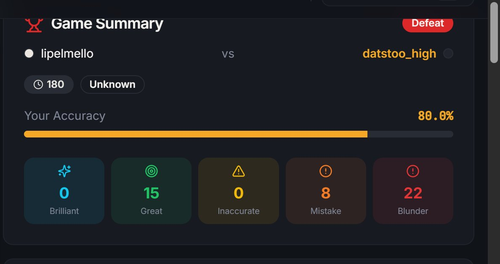
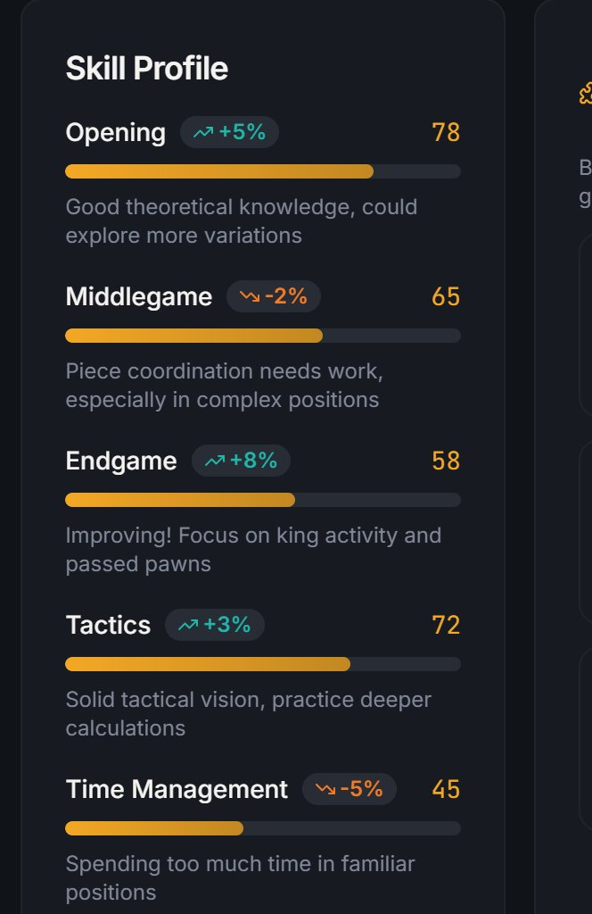

# Chess Training AI

I was tired of losing chess games and not knowing why, so I built this to analyze all my Chess.com games and tell me exactly where I'm messing up.



## What it does

Enter your Chess.com username and it:
- Pulls all your games from Chess.com API
- Runs Stockfish analysis to find where you went wrong
- Generates a skill profile showing your strengths/weaknesses across openings, middlegame, endgame, tactics, and time management
- Recommends specific Lichess puzzles to practice your weak areas



## Tech Stack

**Frontend:** React, TypeScript, Tailwind CSS, Vite

**Backend:** Python, Stockfish, Chess.com API, Lichess API



## How it works

1. You enter your Chess.com username
2. It fetches all your games (I tested with my 147 games)
3. Stockfish analyzes critical positions to find mistakes
4. Categorizes your errors: blunders, mistakes, inaccuracies
5. Builds a skill profile showing where you're weak (opening theory, endgame, tactics, etc.)
6. Matches you with relevant Lichess puzzles based on your weaknesses

## Running it locally

### You need:
- Node.js
- Python 3.9+
- Stockfish engine installed

### Setup:

```bash
# Clone it
git clone https://github.com/yourusername/chess-trainer-ai.git
cd chess-trainer-ai

# Frontend
cd frontend
npm install
npm run dev

# Backend (in another terminal)
cd backend
pip install -r requirements.txt
python app.py
```

Open `http://localhost:5173` and enter your Chess.com username.

## What I learned building this

- How to efficiently analyze thousands of chess positions without taking forever (selective analysis on critical moments only)
- Integrating Stockfish engine with Python
- Building a clean React UI with real-time progress updates
- Categorizing chess mistakes beyond just "bad move" - understanding *why* moves are bad based on position features

## Future stuff I might add

- Support for Lichess accounts
- Comparison feature (compare your stats with friends)
- Opening repertoire recommendations
- Mobile version

---

Built because I kept losing games and needed to know why.
